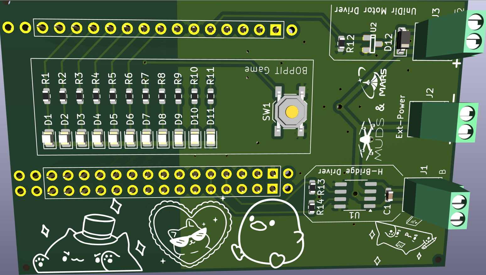

# PCB Workshop KiCAD project

This repository holds the source files used in the KiCAD project.

## DIY

To order PCBs using KiCAD as the PCB design software from JLCPCB follow these guides ([fabrication outputs](https://jlcpcb.com/help/article/How-to-generate-the-BOM-and-Centroid-file-from-KiCAD) and [ordering](https://jlcpcb.com/help/article/how-do-i-place-a-pcba-order)). In short the process is:

1. Generate BOM.
2. Generate Gerber files.
3. Generate Drill files.
4. Generate assembly csv.
5. Modify Files.
   1. Modify BOM to have the correct format (to make ordering easier add LCSC part).
   2. Modify top assembly file to correct format.
6. Zip all gerber files and drill files together.
7. Create an account (Or use google)
8. Order from JLCPCB

To ease this process some **EXAMPLES** outputs are provided [BOM.csv](./out/BOM.csv) and [PCB_WORKSHOP_MUDS_MARS-top-pos.csv](./out/PCB_WORKSHOP_MUDS_MARS-top-pos.csv)

## Images

## Additional notes

When designing boards to be made with JLCPCB adding `JLCJLCJLCJLC` to a silkscreen layer on the board eases fabrication.
In addition adding tooling holes ([1.152mm unplated holes](https://jlcpcb.com/help/article/How-to-add-tooling-holes-for-PCB-assembly-order)) prevents JLC from placing the holes in undesirable locations.